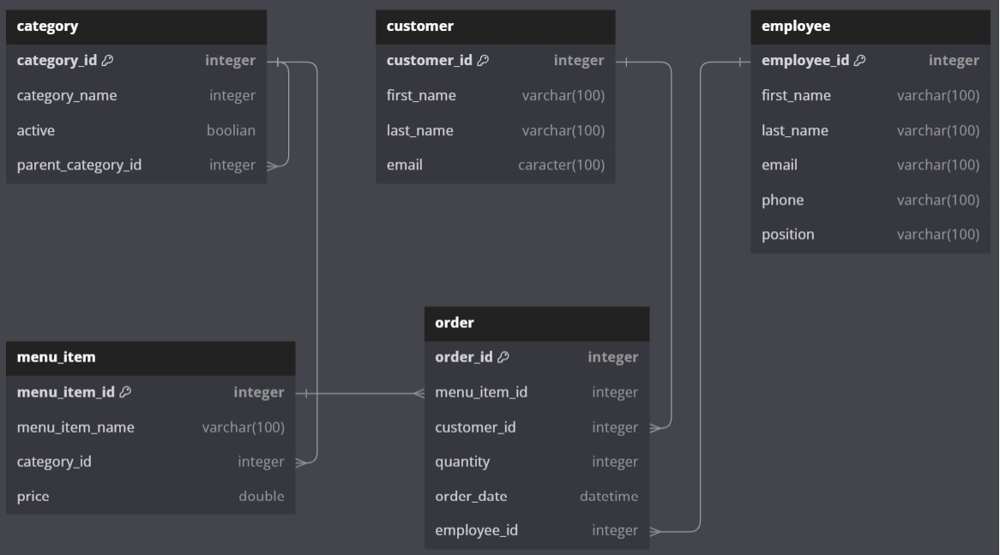

# Fast Food Restaurant REST API

This repository contains the code for a Fast Food Restaurant application's REST API, built using Flask. The API provides endpoints for managing various aspects of the restaurant, including categories, customers, employees, menu items, and orders. Each endpoint supports the following HTTP methods: GET, POST, and DELETE.

# Endpoints
Categories<br />
GET /categories: Retrieve a list of all categories.<br />
GET /categories/{category_id}: Retrieve a category by its ID.<br />
POST /categories: Create a new category.<br />
DELETE /categories/{category_id}: Delete a category by its ID.<br />

Customers<br />
GET /customers: Retrieve a list of all customers.<br />
GET /customers/{customer_id}: Retrieve a customer by its ID.<br />
POST /customers: Create a new customer.<br />
DELETE /customers/{customer_id}: Delete a customer by their ID.<br />

Employees<br />
GET /employees: Retrieve a list of all employees.<br />
GET /employees/{employee_id}: Retrieve a employee by its ID.<br />
POST /employees: Create a new employee.<br />
DELETE /employees/{employee_id}: Delete an employee by their ID.<br />

Menu Items<br />
GET /menu_items: Retrieve a list of all menu items.<br />
GET /menu_items/{menu_item_id}: Retrieve a menu_item by its ID.<br />
POST /menu_items: Create a new menu item.<br />
DELETE /menu_items/{menu_item_id}: Delete a menu item by its ID.<br />

Orders<br />
GET /orders: Retrieve a list of all orders.<br />
GET /orders/{order_id}: Retrieve a order by its ID.<br />
POST /orders: Create a new order.<br />
DELETE /orders/{order_id}: Delete an order by its ID.<br />


# Testing
The API is covered by fixtured tests: unit tests and functional tests. Unit tests ensure that individual components of the API work as expected, while functional tests validate the behavior of the API as a whole. You can run the tests using the following commands:


# Run unit tests and functional tests   
```bash        
python -m pytest
``` 

# Database Model
The Fast Food Restaurant application utilizes a PostgreSQL database with the following tables:

Category: Stores information about different categories of menu items.<br />
Customer: Contains details about the restaurant's customers.<br />
Employee: Stores information about the restaurant's employees.<br />
Menu_Item: Stores details of the items available on the restaurant's menu.<br />
Order: Contains information about customer orders.<br />



The database model has been implemented using SQL scripts, which are committed along with the code. You can find the SQL script for creating the database schema in the sql/create_tables.sql file.


# Getting Started
Clone this repository to your local machine.<br />
Run the server using python app.py.<br />
Access the API endpoints using a tool like Postman or curl.<br />